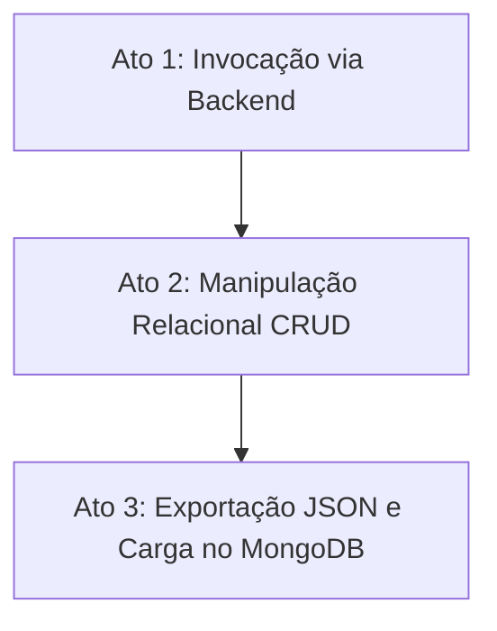

# 📚 Guia Definitivo: Mastering Database & Integração Java (Sprint 4)
> **Projeto:** PetGuardian — Challenge Clyvo 2026 (2TDSPG)  
> **Disciplinas:** Mastering Relational and Non-Relational Database & Java Advanced  
> **Status:** Documento Oficial de Arquitetura e Implementação  

---

## 📑 Sumário

1. [Entendimento dos Requisitos da Sprint 4 (100 Pontos)](#1-entendimento-dos-requisitos-da-sprint-4-100-pontos)
2. [O Papel do MongoDB na Sprint 4: Relacional vs NoSQL](#2-o-papel-do-mongodb-na-sprint-4-relacional-vs-nosql)
3. [Quais Tabelas Migrar para MongoDB? Análise dos Melhores Candidatos](#3-quais-tabelas-migrar-para-mongodb-análise-dos-melhores-candidatos)
   - [Candidato 1: Trilhas, Módulos e Aulas (Recomendado — Padrão Document Store)](#candidato-1-trilhas-módulos-e-aulas-recomendado--padrão-document-store)
   - [Candidato 2: Prontuário / Histórico Médico do Pet (Padrão Polimórfico / Time-Series)](#candidato-2-prontuário--histórico-médico-do-pet-padrão-polimórfico--time-series)
   - [Candidato 3: Tarefas e Gamificação (Alinhado com a Procedure da Sprint 3)](#candidato-3-tarefas-e-gamificação-alinhado-com-a-procedure-da-sprint-3)
4. [Empacotamento PL/SQL (Packages) no Oracle](#4-empacotamento-plsql-packages-no-oracle)
   - [Conceito de Package Specification e Package Body](#conceito-de-package-specification-e-package-body)
   - [Código Completo: `pkg_petguardian`](#código-completo-pkg_petguardian)
5. [Exportação do Banco Relacional e Importação no MongoDB](#5-exportação-do-banco-relacional-e-importação-no-mongodb)
   - [Geração do Dataset JSON a partir do Relacional](#geração-do-dataset-json-a-partir-do-relacional)
   - [Estrutura de Documentos NoSQL Resultante](#estrutura-de-documentos-nosql-resultante)
   - [Scripts de Importação e Índices no MongoDB (`mongosh`)](#scripts-de-importação-e-índices-no-mongodb-mongosh)
6. [Como Invocar Stored Procedures do Banco Diretamente no Java (Spring Boot)](#6-como-invocar-stored-procedures-do-banco-diretamente-no-java-spring-boot)
   - [Padrões de Execução (SimpleJdbcCall vs StoredProcedureQuery vs @Procedure)](#padrões-de-execução)
   - [Implementação Prática Passo a Passo no Java](#implementação-prática-passo-a-passo-no-java)
   - [Atenção ao Ambiente: Conexão Oracle vs PostgreSQL](#atenção-ao-ambiente-conexão-oracle-vs-postgresql)
7. [Roteiro para Gravação do Vídeo Demonstrativo (10 Pontos)](#7-roteiro-para-gravação-do-vídeo-demonstrativo-10-pontos)

---

## 1. Entendimento dos Requisitos da Sprint 4 (100 Pontos)

Conforme a seção **6. Mastering Relational and Non-Relational Database** do [SPRINT_4.md](file:///c:/Users/Enzo/new_backup/FIAP/_Projetos/Challenge_Clyvo_4/SPRINT_4.md), a avaliação é dividida em 5 entregáveis obrigatórios:

| Item | Entregável | Pontuação | O que o avaliador vai checar |
| :---: | :--- | :---: | :--- |
| **1** | **Modelos Lógico e Físico (PDF) + SQL corrigido** | **20 pts** | Diagramas corrigidos segundo feedback da Sprint 3 + script SQL completo e limpo. |
| **2** | **Empacotamento PL/SQL (Packages)** | **25 pts** | Procedimentos, funções e regras empacotados com modularidade, tratamento de exceções e boas práticas. |
| **3** | **Arquivo JSON exportado da base relacional** | **20 pts** | Dataset estruturado extraído diretamente das tabelas relacionais. |
| **4** | **Estrutura MongoDB (Scripts DDL e Import)** | **25 pts** | Código-fonte de criação de coleções/índices e scripts de importação obedecendo aos princípios NoSQL (sem criar tabelas relacionais no MongoDB). |
| **5** | **Vídeo demonstrativo com narração por voz** | **10 pts** | Prova em vídeo: (1) Procedure chamada pelo Java/backend; (2) CRUD no relacional; (3) Exportação JSON e importação no MongoDB. |

---

## 2. O Papel do MongoDB na Sprint 4: Relacional vs NoSQL

### ❌ O que NÃO deve ser feito:
- **Não apague seu banco relacional.** Ele continua sendo o coração do sistema, onde ficam os dados transacionais de usuários, segurança, integridade referencial estrita e as procedures em PL/SQL.
- **Não recrie tabelas relacionais no MongoDB.** Criar uma coleção `usuario`, uma `telefone`, uma `endereco`, uma `bairro`, uma `cidade` e uma `estado` com IDs referenciando um ao outro no MongoDB é um erro grave que o professor penaliza fortemente ("pensamento relacional em banco de documentos").

###  O que DEVE ser feito (Persistência Poliglota):
- No mundo real e no desafio, usamos **Persistência Poliglota**:
  - **Relacional (Oracle):** Dados transacionais que exigem ACID rigoroso, integridade de chave estrangeira, unicidade estrita (ex.: usuários, credenciais, relações N:M como cotutela `USUARIO_PET`).
  - **Não Relacional (MongoDB):** Dados orientados a documentos, leituras frequentes em árvore, conteúdo hierárquico, catálogos educativos ou histórico com atributos variáveis.
- O professor pediu para **escolher as entidades que façam sentido** para serem modeladas como Documentos NoSQL, gerar o JSON do relacional e importar no MongoDB.

---

## 3. Quais Tabelas Migrar para MongoDB? Análise dos Melhores Candidatos

Avaliando o modelo relacional de 16 tabelas da Sprint 3, temos **3 fortes candidatos**. Vamos analisar os prós e contras arquiteturais de cada um:

### Candidato 1: Trilhas, Módulos e Aulas (⭐ RECOMENDADO — Padrão Document Store)
* **Entidades Relacionais Atuais:** `TRILHA` (1:N) `MODULO` (1:N) `AULA`.
* **Como é no Relacional:** 3 tabelas normalizadas. Para carregar uma trilha no App Mobile, são necessários 2 `JOIN`s complexos ou 3 viagens ao banco (N+1 queries).
* **Como fica no MongoDB:** **1 única coleção chamada `trilhas`**.
  - Cada documento representa uma trilha completa.
  - Os módulos são um **array de subdocumentos embutidos** (`modulos: [...]`).
  - As aulas de cada módulo são **arrays embutidos dentro de cada módulo** (`aulas: [...]`).
* **Por que é o melhor candidato técnico para apresentar ao professor?**
  1. **Composição Forte e Ciclo de Vida Vinculado:** Uma aula ou módulo não existe solto no universo sem sua trilha correspondente.
  2. **Atomicidade de Leitura (Zero JOINs):** Com uma única query indexada (`db.trilhas.findOne({ _id: ObjectId(...) })`), o backend ou app recupera a trilha inteira formatada para a UI em milissegundos.
  3. **Esquema Flexível:** No relacional, a tabela `AULA` tem um campo fixo `conteudo VARCHAR2(1000)`. No MongoDB, cada aula pode ter estruturas heterogêneas (ex.: tipo `"video"` com URL e duração, tipo `"quiz"` com lista de perguntas e alternativas, tipo `"artigo"` com markdown), demonstrando a superioridade do NoSQL para conteúdo.

---

### Candidato 2: Prontuário / Histórico Médico do Pet (Padrão Polimórfico / Time-Series)
* **Entidades Relacionais Atuais:** `HISTORICO` e `PET`.
* **Como é no Relacional:** A tabela `HISTORICO` tem apenas colunas simples (`id_hist`, `tipo_hist`, `data_hist`, `pet_id_pet`).
* **Como fica no MongoDB:**
  - Coleção `pet_historico` ou documento de `pet` com array embutido de `historico_eventos`.
  - Cada evento de histórico é um subdocumento polimórfico:
    - Se for **Vacina**: guarda `{ tipo: "VACINA", fabricante: "Zoetis", lote: "98234", validade: "2027-01-01", dose: 1 }`.
    - Se for **Consulta**: guarda `{ tipo: "CONSULTA", veterinario: "Dr. Silva", crmv: "12345-SP", diagnostico: "Gastroenterite", medicamentos: [...] }`.
    - Se for **Exame**: guarda `{ tipo: "EXAME", laboratorio: "VetLab", arquivo_laudo_url: "https://...", resultado: "Normal" }`.
* **Por que faz sentido:** No banco relacional, criar colunas para todos os tipos de atendimento gera tabelas cheias de `NULL` ou exige herança relacional complexa. No MongoDB, o documento é flexível e expressivo.

---

### Candidato 3: Tarefas e Gamificação (Alinhado com a Procedure da Sprint 3)
* **Entidades Relacionais Atuais:** `TAREFA`, `STATUS`, `PET`, `USUARIO`.
* **Como é no Relacional:** Tarefa normalizada com FKs para Pet, Status e Usuário.
* **Como fica no MongoDB:** Coleção `tarefas_detalhadas` desnormalizada.
* **Vantagem Imediata:** Na Sprint 3, a equipe já escreveu a função `fn_tarefa_json` e a procedure `pr_listar_tarefas_json`, cujo objetivo já era gerar JSON das tarefas com os nomes de pet, status e usuário embutidos. Isso significa que o script de exportação JSON já está 80% pronto.

> 💡 **Recomendação de Arquitetura:**  
> A solução ideal é adotar **Trilhas, Módulos e Aulas** como a principal coleção rica de documentos no MongoDB (Document Embedding), e utilizar a exportação JSON de **Tarefas** via PL/SQL para provar a exportação automatizada da Sprint 3!

---

## 4. Empacotamento PL/SQL (Packages) no Oracle

Na Sprint 3, você criou procedimentos e funções soltas no banco. A Sprint 4 exige **Package (Pacote)**.  
Um pacote no Oracle é dividido em duas partes fundamentais:
1. **`PACKAGE SPECIFICATION` (Especificação/Interface):** Declara as assinaturas públicas das funções, procedimentos, tipos e exceções. Funciona como uma interface no Java.
2. **`PACKAGE BODY` (Corpo/Implementação):** Contém a lógica de negócio detalhada, cursores privados e o corpo das rotinas.

### Código Completo da Package: `pkg_petguardian`

Abaixo está o script pronto para substituir as rotinas soltas da Sprint 3 pelo pacote corporativo oficial:

```sql
-- ====================================================================
-- 1. ESPECIFICAÇÃO DO PACOTE (PACKAGE SPECIFICATION)
-- ====================================================================
CREATE OR REPLACE PACKAGE pkg_petguardian AS
    -- Exceções públicas padronizadas
    e_id_invalido            EXCEPTION;
    e_dados_incompletos      EXCEPTION;
    e_json_excedente         EXCEPTION;
    e_status_inexistente     EXCEPTION;
    e_sem_registros          EXCEPTION;
    e_pontos_invalido        EXCEPTION;

    -- Função que serializa uma tarefa individual em string JSON
    FUNCTION fn_tarefa_json (
        p_id_tarefa     IN NUMBER,
        p_titulo        IN VARCHAR2,
        p_pontos        IN NUMBER,
        p_descricao     IN VARCHAR2,
        p_nome_pet      IN VARCHAR2,
        p_nome_status   IN VARCHAR2,
        p_nome_usuario  IN VARCHAR2
    ) RETURN VARCHAR2;

    -- Procedimento que lista tarefas e gera JSON no console (DBMS_OUTPUT)
    PROCEDURE pr_listar_tarefas_json (
        p_status_id IN NUMBER DEFAULT NULL
    );

    -- Procedimento novo para integração Java: Retorna JSON consolidado via parâmetro OUT
    PROCEDURE pr_exportar_tarefas_json (
        p_status_id    IN NUMBER DEFAULT NULL,
        p_json_output  OUT CLOB
    );

    -- Função que calcula a categoria de gamificação do pet/tutor
    FUNCTION fn_classificar_pontos (
        p_pontos IN NUMBER
    ) RETURN VARCHAR2;

    -- Procedimento de consolidação tabular com quebra de grupo manual
    PROCEDURE pr_resumo_pontos_tarefas;

END pkg_petguardian;
/

-- ====================================================================
-- 2. CORPO DO PACOTE (PACKAGE BODY)
-- ====================================================================
CREATE OR REPLACE PACKAGE BODY pkg_petguardian AS

    -- ----------------------------------------------------------------
    -- IMPLEMENTAÇÃO: fn_tarefa_json
    -- ----------------------------------------------------------------
    FUNCTION fn_tarefa_json (
        p_id_tarefa     IN NUMBER,
        p_titulo        IN VARCHAR2,
        p_pontos        IN NUMBER,
        p_descricao     IN VARCHAR2,
        p_nome_pet      IN VARCHAR2,
        p_nome_status   IN VARCHAR2,
        p_nome_usuario  IN VARCHAR2
    ) RETURN VARCHAR2 IS
        v_json VARCHAR2(4000);
    BEGIN
        IF p_id_tarefa IS NULL OR p_id_tarefa <= 0 THEN
            RAISE_APPLICATION_ERROR(-20001, 'ID da tarefa nulo ou inválido.');
        END IF;

        IF p_titulo IS NULL OR p_nome_pet IS NULL OR p_nome_status IS NULL OR p_nome_usuario IS NULL THEN
            RAISE_APPLICATION_ERROR(-20002, 'Atributos obrigatórios não preenchidos.');
        END IF;

        v_json := '{' ||
                  '"id_tarefa":' || p_id_tarefa || ',' ||
                  '"titulo":"' || REPLACE(REPLACE(p_titulo, '\', '\\'), '"', '\"') || '",' ||
                  '"pontos":' || NVL(p_pontos, 0) || ',' ||
                  '"descricao":"' || REPLACE(REPLACE(NVL(p_descricao, ''), '\', '\\'), '"', '\"') || '",' ||
                  '"pet":"' || REPLACE(REPLACE(p_nome_pet, '\', '\\'), '"', '\"') || '",' ||
                  '"status":"' || p_nome_status || '",' ||
                  '"cuidador_responsavel":"' || REPLACE(REPLACE(p_nome_usuario, '\', '\\'), '"', '\"') || '"' ||
                  '}';

        IF LENGTH(v_json) > 3800 THEN
            RAISE_APPLICATION_ERROR(-20003, 'Tamanho do JSON excedeu limite de segurança.');
        END IF;

        RETURN v_json;
    END fn_tarefa_json;

    -- ----------------------------------------------------------------
    -- IMPLEMENTAÇÃO: pr_listar_tarefas_json (Console DBMS_OUTPUT)
    -- ----------------------------------------------------------------
    PROCEDURE pr_listar_tarefas_json (
        p_status_id IN NUMBER DEFAULT NULL
    ) IS
        CURSOR c_tarefas IS
            SELECT t.id_tarefa, t.titulo, t.pontos_tarefa, t.descricao,
                   p.nome AS nome_pet, s.nome_status, u.nome AS nome_usuario
              FROM tarefa t
              JOIN pet p     ON t.pet_id_pet = p.id_pet
              JOIN status s  ON t.status_id_status = s.id_status
              JOIN usuario u ON t.usuario_id_usuario = u.id_usuario
             WHERE p_status_id IS NULL OR t.status_id_status = p_status_id
             ORDER BY t.id_tarefa;

        r_tarefa c_tarefas%ROWTYPE;
        v_qtd    NUMBER := 0;
    BEGIN
        DBMS_OUTPUT.PUT_LINE('--- INICIO DO EXPORT JSON (PKG_PETGUARDIAN) ---');
        OPEN c_tarefas;
        LOOP
            FETCH c_tarefas INTO r_tarefa;
            EXIT WHEN c_tarefas%NOTFOUND;
            DBMS_OUTPUT.PUT_LINE(fn_tarefa_json(
                r_tarefa.id_tarefa, r_tarefa.titulo, r_tarefa.pontos_tarefa,
                r_tarefa.descricao, r_tarefa.nome_pet, r_tarefa.nome_status, r_tarefa.nome_usuario
            ));
            v_qtd := v_qtd + 1;
        END LOOP;
        CLOSE c_tarefas;

        IF v_qtd = 0 THEN
            RAISE_APPLICATION_ERROR(-20006, 'Nenhuma tarefa encontrada.');
        END IF;
    END pr_listar_tarefas_json;

    -- ----------------------------------------------------------------
    -- IMPLEMENTAÇÃO: pr_exportar_tarefas_json (Para consumo via Java)
    -- ----------------------------------------------------------------
    PROCEDURE pr_exportar_tarefas_json (
        p_status_id    IN NUMBER DEFAULT NULL,
        p_json_output  OUT CLOB
    ) IS
        CURSOR c_tarefas IS
            SELECT t.id_tarefa, t.titulo, t.pontos_tarefa, t.descricao,
                   p.nome AS nome_pet, s.nome_status, u.nome AS nome_usuario
              FROM tarefa t
              JOIN pet p     ON t.pet_id_pet = p.id_pet
              JOIN status s  ON t.status_id_status = s.id_status
              JOIN usuario u ON t.usuario_id_usuario = u.id_usuario
             WHERE p_status_id IS NULL OR t.status_id_status = p_status_id
             ORDER BY t.id_tarefa;

        r_tarefa  c_tarefas%ROWTYPE;
        v_primeiro BOOLEAN := TRUE;
    BEGIN
        p_json_output := '[';
        OPEN c_tarefas;
        LOOP
            FETCH c_tarefas INTO r_tarefa;
            EXIT WHEN c_tarefas%NOTFOUND;

            IF NOT v_primeiro THEN
                p_json_output := p_json_output || ',';
            END IF;

            p_json_output := p_json_output || fn_tarefa_json(
                r_tarefa.id_tarefa, r_tarefa.titulo, r_tarefa.pontos_tarefa,
                r_tarefa.descricao, r_tarefa.nome_pet, r_tarefa.nome_status, r_tarefa.nome_usuario
            );
            v_primeiro := FALSE;
        END LOOP;
        CLOSE c_tarefas;
        p_json_output := p_json_output || ']';
    END pr_exportar_tarefas_json;

    -- ----------------------------------------------------------------
    -- IMPLEMENTAÇÃO: fn_classificar_pontos
    -- ----------------------------------------------------------------
    FUNCTION fn_classificar_pontos (
        p_pontos IN NUMBER
    ) RETURN VARCHAR2 IS
    BEGIN
        IF p_pontos IS NULL OR p_pontos < 0 THEN
            RAISE_APPLICATION_ERROR(-20010, 'Pontuação inválida: deve ser >= 0.');
        END IF;

        IF p_pontos <= 20 THEN
            RETURN 'BRONZE (BÁSICO)';
        ELSIF p_pontos <= 45 THEN
            RETURN 'PRATA (INTERMEDIÁRIO)';
        ELSIF p_pontos <= 75 THEN
            RETURN 'OURO (AVANÇADO)';
        ELSE
            RETURN 'DIAMANTE (MASTER)';
        END IF;
    END fn_classificar_pontos;

    -- ----------------------------------------------------------------
    -- IMPLEMENTAÇÃO: pr_resumo_pontos_tarefas
    -- ----------------------------------------------------------------
    PROCEDURE pr_resumo_pontos_tarefas IS
        CURSOR c_fatos IS
            SELECT p.id_pet, p.nome AS nome_pet, s.id_status, s.nome_status, t.pontos_tarefa
              FROM tarefa t
              JOIN pet p    ON t.pet_id_pet = p.id_pet
              JOIN status s ON t.status_id_status = s.id_status
             ORDER BY p.id_pet ASC, s.id_status ASC;

        r_linha             c_fatos%ROWTYPE;
        v_pet_atual         pet.id_pet%TYPE := NULL;
        v_nome_pet_atual    pet.nome%TYPE := NULL;
        v_status_atual      status.id_status%TYPE := NULL;
        v_nome_status_atual status.nome_status%TYPE := NULL;
        v_soma_combinacao   NUMBER(10,2) := 0;
        v_subtotal_pet      NUMBER(10,2) := 0;
        v_total_geral       NUMBER(10,2) := 0;
        v_qtd               NUMBER := 0;
    BEGIN
        OPEN c_fatos;
        DBMS_OUTPUT.PUT_LINE(RPAD('Pet', 18) || ' ' || RPAD('Status', 16) || ' ' || LPAD('Pontos', 12));
        DBMS_OUTPUT.PUT_LINE(RPAD('-', 18, '-') || ' ' || RPAD('-', 16, '-') || ' ' || LPAD('-', 12, '-'));

        LOOP
            FETCH c_fatos INTO r_linha;
            IF (c_fatos%NOTFOUND OR r_linha.id_pet <> v_pet_atual OR r_linha.id_status <> v_status_atual)
               AND v_pet_atual IS NOT NULL THEN
                DBMS_OUTPUT.PUT_LINE(
                    RPAD(v_pet_atual || ' - ' || v_nome_pet_atual, 18) || ' ' ||
                    RPAD(v_status_atual || ' - ' || v_nome_status_atual, 16) || ' ' ||
                    LPAD(TO_CHAR(v_soma_combinacao, 'FM999990.00'), 12)
                );
                v_subtotal_pet    := v_subtotal_pet + v_soma_combinacao;
                v_total_geral     := v_total_geral + v_soma_combinacao;
                v_soma_combinacao := 0;

                IF c_fatos%NOTFOUND OR r_linha.id_pet <> v_pet_atual THEN
                    DBMS_OUTPUT.PUT_LINE(RPAD('Sub Total', 35) || LPAD(TO_CHAR(v_subtotal_pet, 'FM999990.00'), 12));
                    v_subtotal_pet := 0;
                END IF;
            END IF;

            EXIT WHEN c_fatos%NOTFOUND;

            v_pet_atual         := r_linha.id_pet;
            v_nome_pet_atual    := r_linha.nome_pet;
            v_status_atual      := r_linha.id_status;
            v_nome_status_atual := r_linha.nome_status;
            v_soma_combinacao   := v_soma_combinacao + r_linha.pontos_tarefa;
            v_qtd               := v_qtd + 1;
        END LOOP;
        CLOSE c_fatos;

        IF v_qtd = 0 THEN
            RAISE_APPLICATION_ERROR(-20013, 'Sem tarefas cadastradas.');
        END IF;

        DBMS_OUTPUT.PUT_LINE(RPAD('Total Geral', 35) || LPAD(TO_CHAR(v_total_geral, 'FM999990.00'), 12));
    END pr_resumo_pontos_tarefas;

END pkg_petguardian;
/
```

---

## 5. Exportação do Banco Relacional e Importação no MongoDB

### Geração do Dataset JSON a partir do Relacional
Para a entrega do item 3 (Arquivo JSON), você pode gerar o JSON das **Trilhas com Módulos e Aulas** ou das **Tarefas** diretamente via SQL ou ferramenta de banco (SQL Developer / DBeaver / DataGrip).

#### Query SQL no Oracle para gerar o JSON hierárquico de Trilhas:
```sql
SELECT JSON_OBJECT(
    'id_trilha' VALUE t.id_trilha,
    'nome' VALUE t.nome,
    'descricao' VALUE t.descricao,
    'id_pet' VALUE t.pet_id_pet,
    'modulos' VALUE (
        SELECT JSON_ARRAYAGG(
            JSON_OBJECT(
                'id_modulo' VALUE m.id_modulo,
                'nome' VALUE m.nome,
                'tempo_conclusao' VALUE m.tempo_conclusao,
                'descricao' VALUE m.descricao,
                'aulas' VALUE (
                    SELECT JSON_ARRAYAGG(
                        JSON_OBJECT(
                            'id_aula' VALUE a.id_aula,
                            'nome' VALUE a.nome,
                            'descricao' VALUE a.descricao,
                            'pontos' VALUE a.pontos_aula,
                            'dificuldade' VALUE a.dificuldade,
                            'concluida' VALUE CASE WHEN a.concluida = 1 THEN TRUE ELSE FALSE END
                        )
                    )
                    FROM aula a WHERE a.modulo_id_modulo = m.id_modulo
                )
            )
        )
        FROM modulo m WHERE m.trilha_id_trilha = t.id_trilha
    )
) AS doc_trilha_json
FROM trilha t;
```

### Estrutura de Documentos NoSQL Resultante (`trilhas.json`)
```json
[
  {
    "_id": "6701a1b2c3d4e5f600000001",
    "trilha_id_origem": 1,
    "nome": "Socialização Básica de Filhotes",
    "descricao": "Trilha para condicionamento de filhotes e convivência harmoniosa em família",
    "categoria": "COMPORTAMENTO",
    "pet_alvo": {
      "pet_id": 1,
      "nome": "Thor",
      "porte": "MEDIO"
    },
    "modulos": [
      {
        "modulo_id": 101,
        "titulo": "Primeiros Passos e Comandos",
        "tempo_estimado": "45 min",
        "aulas": [
          {
            "aula_id": 1001,
            "titulo": "Comando Sentar com Recompensa",
            "pontos_recompensa": 20,
            "dificuldade": "INICIANTE",
            "concluida": true,
            "tipo_conteudo": "VIDEO_PRATICO",
            "recursos": {
              "video_url": "https://storage.petguardian.com/videos/aula1.mp4",
              "checklist": ["Pet em jejum de 2h", "Petiscos de alto valor separados"]
            }
          },
          {
            "aula_id": 1002,
            "titulo": "Foco no Olhar e Chamado",
            "pontos_recompensa": 30,
            "dificuldade": "INICIANTE",
            "concluida": false,
            "tipo_conteudo": "GUIA_INTERATIVO"
          }
        ]
      }
    ],
    "criado_em": "2026-10-01T20:00:00Z"
  }
]
```

### Scripts de Importação e Índices no MongoDB (`mongosh`)

Para cumprir o **Item 4 (Estrutura MongoDB - 25 pontos)**, crie o arquivo de script de criação e importação:

```javascript
// ====================================================================
// SCRIPT: setup_mongodb_petguardian.js
// Execução: mongosh "mongodb://localhost:27017/petguardian_nosql" setup_mongodb_petguardian.js
// ====================================================================

// 1. Conecta ou cria o banco de dados da aplicação
use petguardian_nosql;

// 2. Cria a coleção com Validação de Schema (JSON Schema Validator)
db.createCollection("trilhas_educativas", {
   validator: {
      $jsonSchema: {
         bsonType: "object",
         required: ["nome", "descricao", "modulos"],
         properties: {
            nome: {
               bsonType: "string",
               description: "Nome da trilha deve ser string e é obrigatório."
            },
            descricao: {
               bsonType: "string"
            },
            modulos: {
               bsonType: "array",
               description: "Lista de módulos obrigatória com composição embutida.",
               items: {
                  bsonType: "object",
                  required: ["titulo", "aulas"],
                  properties: {
                     titulo: { bsonType: "string" },
                     aulas: { bsonType: "array" }
                  }
               }
            }
         }
      }
   }
});

// 3. Criação de Índices Estratégicos de Alta Performance
// Índice único no identificador relacional de origem para garantir idempotência na sincronização
db.trilhas_educativas.createIndex({ "trilha_id_origem": 1 }, { unique: true });

// Índice composto para busca por pet e status de conclusão
db.trilhas_educativas.createIndex({ "pet_alvo.pet_id": 1, "modulos.aulas.concluida": 1 });

// Índice de texto para busca rápida na tela mobile
db.trilhas_educativas.createIndex({ "nome": "text", "descricao": "text" });

print("Coleção 'trilhas_educativas' e índices criados com sucesso!");
```

#### Comando de Importação via Terminal (`mongoimport`):
```bash
mongoimport --uri="mongodb://localhost:27017/petguardian_nosql" --collection=trilhas_educativas --file=trilhas.json --jsonArray --mode=upsert --upsertFields=trilha_id_origem
```

---

## 6. Como Invocar Stored Procedures do Banco Diretamente no Java (Spring Boot)

A Sprint 4 exige explicitamente:
> *"As procedures criadas deverão ser invocadas diretamente via aplicação, demonstrando sua execução funcional no vídeo."*

### Padrões de Execução no Spring Boot

Existem 3 formas de fazer isso no ecossistema Spring:
1. **`SimpleJdbcCall` (⭐ A Mais Recomendada para Oracle Packages):** Classe nativa do Spring JDBC feita sob medida para lidar com `PACKAGE.PROCEDURE`, parâmetros `IN`/`OUT` e cursores complexos sem dores de cabeça do Hibernate.
2. **`EntityManager.createStoredProcedureQuery()`:** Padrão JPA 2.1+. Funciona muito bem quando a procedure possui parâmetros registrados formalmente.
3. **`@Procedure` do Spring Data JPA:** Anotação na interface do repositório. Simples para procedures com retorno primitivo escalar.

### Implementação Prática no Java (Padrão KISS com Spring Data JPA)

Eliminando qualquer camada intermediária desnecessária (zero wrappers), integramos as chamadas diretamente no repositório e controller existentes de Tarefas:

#### 1. Repositório: `TarefaRepository.java`
Utilizamos a anotação nativa `@Procedure` para a procedure com parâmetro de saída `OUT CLOB` e `@Query(nativeQuery = true)` para a função escalar do Oracle:

```java
package fiap.com.br.petguardian.tarefa;

import org.springframework.data.jpa.repository.JpaRepository;
import org.springframework.data.jpa.repository.Query;
import org.springframework.data.jpa.repository.query.Procedure;
import org.springframework.data.repository.query.Param;

public interface TarefaRepository extends JpaRepository<Tarefa, Long> {

    // Invoca Stored Procedure com parâmetro OUT CLOB no pacote Oracle
    @Procedure(procedureName = "pkg_petguardian.pr_exportar_tarefas_json")
    String exportarTarefasJsonNoBanco(@Param("p_status_id") Long statusId);

    // Invoca Function escalar de negócio no pacote Oracle
    @Query(value = "SELECT pkg_petguardian.fn_classificar_pontos(:pontos) FROM DUAL", nativeQuery = true)
    String classificarPontosNoBanco(@Param("pontos") Integer pontos);
}
```

#### 2. Serviço: `TarefaService.java`
Delegando a execução transacional:

```java
@Transactional(readOnly = true)
public String exportarTarefasJson(Long statusId) {
    return tarefaRepository.exportarTarefasJsonNoBanco(statusId);
}

@Transactional(readOnly = true)
public String classificarPontos(Integer pontos) {
    return tarefaRepository.classificarPontosNoBanco(pontos);
}
```

#### 3. Controller: `TarefaController.java`
Expondo as rotinas nos endpoints REST já documentados no OpenAPI/Swagger:

```java
@GetMapping(value = "/procedure/exportar-json", produces = MediaType.APPLICATION_JSON_VALUE)
@ResponseStatus(HttpStatus.OK)
@Operation(summary = "Executar Stored Procedure pkg_petguardian.pr_exportar_tarefas_json no Oracle e retornar o JSON serializado pelo banco")
public ResponseEntity<String> exportarTarefasJson(@RequestParam(required = false) Long statusId) {
    return ResponseEntity.ok(tarefaService.exportarTarefasJson(statusId));
}

@GetMapping("/procedure/classificar-pontos/{pontos}")
@ResponseStatus(HttpStatus.OK)
@Operation(summary = "Executar Stored Function pkg_petguardian.fn_classificar_pontos no Oracle e retornar a categoria calculada")
public ResponseEntity<Map<String, Object>> classificarPontos(@PathVariable Integer pontos) {
    String categoria = tarefaService.classificarPontos(pontos);
    return ResponseEntity.ok(Map.of(
            "pontos_informados", pontos,
            "categoria_calculada_no_banco", categoria
    ));
}
```

### Configuração de Conexão com o Oracle da FIAP

No arquivo `application.properties`:
```properties
# Oracle Database
spring.datasource.url=${ORACLE_URL}
spring.datasource.username=${ORACLE_USER}
spring.datasource.password=${ORACLE_PASSWORD}
spring.datasource.driver-class-name=oracle.jdbc.OracleDriver
spring.jpa.database-platform=org.hibernate.dialect.OracleDialect
spring.jpa.hibernate.ddl-auto=none
```

No arquivo `.env` (não versionado no Git):
```properties
ORACLE_HOST=oracle.fiap.com.br
ORACLE_PORT=1521
ORACLE_SERVICE=orcl
ORACLE_USER=RM561432
ORACLE_PASSWORD=sua_senha
```

---

## 7. Roteiro para Gravação do Vídeo Demonstrativo (10 Pontos)

O vídeo da disciplina de Database não precisa ser longo (5 a 8 minutos são suficientes), mas **deve cobrir obrigatoriamente estes 3 atos**:



### Roteiro Minuto a Minuto:

1. **Ato 1: A Invocação da Procedure pelo Backend (2 a 3 min)**
   - Abra a IDE (Java).
   - Mostre o `ProcedureIntegrationService` e o Controller.
   - Abra o **Swagger UI** ou **Postman** e faça uma requisição para `/api/database-procedures/tarefas-json`.
   - Mostre a resposta retornando com sucesso o JSON serializado pelo banco de dados.

2. **Ato 2: Manipulação e DML no Banco Relacional (2 min)**
   - No SQL Developer ou DBeaver, mostre a tabela `tarefa` ou `trilha`.
   - Execute um `INSERT` ou `UPDATE` de uma nova tarefa/trilha.
   - Mostre o `SELECT` comprovando o dado inserido.
   - Mostre o registro gerado automaticamente na tabela de auditoria (`AUDITORIA_DML_TAREFA`) pelo disparo da trigger.

3. **Ato 3: Exportação JSON e Carga no MongoDB (2 min)**
   - Mostre o arquivo JSON exportado da base relacional (`trilhas.json` ou `tarefas.json`).
   - Abra o terminal e execute o comando `mongoimport` ou script de inserção no `mongosh`.
   - Abra o **MongoDB Compass** (ou terminal), execute `db.trilhas_educativas.find().pretty()` e mostre os documentos armazenados com os subdocumentos embutidos e os índices criados.
   - Conclua explicando a justificativa de ter escolhido aquela estrutura em documentos para otimizar as consultas da aplicação.
